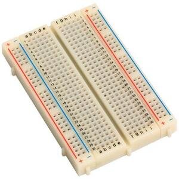

# 23 - Mòdul sensor digital de temperatura


## Material

|                                 Imatge                                 | Descripció                     |
| :--------------------------------------------------------------------: | :----------------------------- |
|       | Arduino Uno o equivalent.      |
|  | Protoboard                     |
|      | Cables de connexió             |
|      | Mòdul sensor temperatura KY028 |

## Finalitat

En aquest experiment, aprendrem a usar el mòdul de temperatura digital i
el mòdul de temperatura analògic.

## Mòdul de temperatura digital

Mòdul de detecció de temperatura usant un termistor NTC. El senyal
d'eixida en 'DO' canvia a nivell alt quan s'aconsegueix la
temperatura preestablida (ajustable). Un senyal d'eixida analògica del
sensor està disponible en el pin 'AO'.


## Especificacions

Aquest mòdul consta d'un termistor NTC, un comparador diferencial dual
LM393, un potenciòmetre d'ajust, 6 resistències, 2 LED i 4 pins de
capçal mascle. El mòdul compta amb eixides analògiques i digitals.

- Voltatge de funcionament: 3,3 V ~ 5,5 V
- Rang de mesurament de temperatura: -55 °C a 125 °C
- Precisió de mesurament: ±0,5 °C
- Dimensions de la placa: 15 mm x 36 mm

## Configuració de pins

Connecteu l'eixida analògica (A0) de la placa al pin A0 del Arduino i
l'eixida digital (D0) al pin 3. Connecte la línia d'alimentació (+) i
terra (G) a 5V i GND respectivament.

| Módul | Arduino |
| ----- | ------- |
| A0    | Pin A0  |
| G     | GND     |
| +     | +5V     |
| D0    | Pin 2   |

## Què és un termistor NTC?


Els termistors són elements sensors de temperatura fets de material
semiconductor que ha sigut sinteritzat per a mostrar grans canvis de
resistència en proporció a xicotets canvis de temperatura.

Aquesta resistència es pot mesurar utilitzant un corrent continu xicotet
i mesura, o cc, que passa a través del termistor per a mesurar la
caiguda de voltatge produïda.


Els termistors NTC són resistències no lineals que alteren les seues
característiques de resistència amb la temperatura.

La resistència de NTC disminuirà a mesura que augmente la temperatura.
La forma en què la resistència disminueix està relacionada amb una
constant coneguda en la indústria electrònica com a beta o ß. Beta es
mesura en °K.

El Arduino té diversos ports ADC que podem usar per a llegir un
voltatge, o més aviat un 'valor ADC'. Si el port analògic està
connectat a Vcc, el valor màxim que es llig és 1023 i, per descomptat,
quan està connectat a terra és 0.

Ara, si fem un divisor de voltatge que és típicament dues resistències
en sèrie entre Vcc i terra i el port analògic en el mig, la lectura
dependrà de la relació de les dues resistències, si són iguals, la
lectura serà 512, a la meitat de 1023. Si un dels resistors, diguem que
l'inferior és un NTC, les lectures en el port analògic variaran amb la
temperatura. Si la temperatura baixa, el valor de la resistència
augmenta i també el farà la lectura en el port analògic.

Suposem que tenim una resistència Sèrie 10k i un NTC que ara com ara
diem 'R'.

Llavors el voltatge que es pot mesurar en el mig és

$$V_{o}=\frac{R}{R + 10K} \cdot V_{cc}$$

No obstant això, les lectures del port analògic no donen un voltatge
sinó un valor ADC que es pot calcular fàcilment.

$$Valor ADC = 1023 \cdot \frac{V_{o}}{V_{cc}}$$

si, per exemple, Vo = 4 volts, l'ADC = 818 o el valor ADC = 1023 \*(Vo/VCC)

Si ara combinem les dues fórmules o, com es diu, 'substituïm' Vo en la
fórmula per a ADC, obtenim el següent:

$$Valor ADC= \frac{R}{R + 10K} \cdot V_{cc} \cdot \frac{1023}{Vcc}$$

A mesura que multipliquem per Vcc però també dividim per Vcc, podem
traure això de l'equació i acabar amb

$$Valor ADC= \frac{R}{R + 10K} \cdot 1023$$

si volem traure el valor de R d'aqueixa equació, això es converteix en

$$R = \frac{10K}{(\frac{1023}{ADC}-1)}$$

Llavors, sempre que sapiem el valor de la resistència en sèrie, podem
calcular el valor del NTC a partir del valor ADC mesurat. Ara recorde,
això és vàlid per a una configuració pull-up. Si es tracta d'una
configuració pull-down, el càlcul del valor de l'ADC a la resistència
és l'invers.

$R_{ntc} = 10K \cdot (\frac{1023}{ADC}-1)$; per a la configuració pull-down

$R_{ntc} = 10K / (\frac{1023}{ADC}-1)$; per a la configuració pull-up

**_Aleshores, com es veuria això en un programa?_**

```Arduino
//Medint el valor de resistencia de NTC

byte NTCPin = A0;
const int SERIESRESISTOR = 10000;

void setup()
{
  Serial.begin(9600);
}

void loop()
{
  float ADCvalue;
  float Resistance;
  ADCvalue = analogRead(NTCPin);
  Serial.print("Analoge ");
  Serial.print(ADCvalue);
  Serial.print(" = ");

  //convertir el valor en resistencia

  Resistance = (1023 / ADCvalue) - 1;
  Resistance = SERIESRESISTOR / Resistance;
  Serial.print(Resistance);
  Serial.println(" Ohm");
  delay(1000);
}
```

Conéixer la resistència del NTC és bo però no ens diu molt sobre la
temperatura... o sí?

Bé, molts NTC tenen un valor nominal que es mesura a 25 ºC, per la qual
cosa si té un NTC de 10k i mesura 10k, això significa que hi han 25ºC en
aqueix moment. Això no t'ajuda molt quan la mesura és diferent.

Podria mantindre una taula en la qual cada valor de resistència
represente una temperatura. Aqueixes taules són molt precises però
requereixen molta faena i espai de memòria.

No obstant això, hi ha una fórmula, l'equació de Steinhart-Hart, que fa
una bona aproximació per a convertir els valors de resistència d'un NTC
en temperatura. No és tan exacte com la taula de termistors (després de
tot, és una aproximació), però és bastant precís.

L'equació de Steinhart-Hart es veu així:

$${\frac{1}{T} = {A + {B \cdot \ln}}}{{(R)} + {C \cdot {({\ln{(R)}})}^{3}}}$$

Aquesta és una equació bastant complexa que requereix diversos
paràmetres (A, B, C) que normalment no tenim per al funcionament del
NTC. Hi ha dues coses que podem fer. Podem prendre 3 lectures amb una
temperatura calibrada i després calcular els paràmetres A, B i C.

$$
{\begin{bmatrix}
1 & {\ln{({R1})}} & {({\ln{({R1})}})}^{3} \\
1 & {\ln{({R2})}} & {({\ln{({R2})}})}^{3} \\
1 & {\ln{({R3})}} & {({\ln{({R3})}})}^{3} \\
\end{bmatrix} \cdot \begin{bmatrix}
A \\
B \\
C \\
\end{bmatrix}} = \begin{bmatrix}
\frac{1}{T_{1}} \\
\frac{1}{T_{2}} \\
\frac{1}{T_{3}} \\
\end{bmatrix}
$$

però afortunadament hi ha una simplificació d'aquesta fórmula,
anomenada Equació del paràmetre B. Aqueix es veu de la següent manera:

$${\frac{1}{T} = {\frac{1}{T_{0}} + {\frac{1}{B} \cdot \ln}}}{(\frac{R}{R_{0}})}$$

T~0~ és la temperatura nominal, 25 °C en Kelvin (= 298,15 K). B és el
coeficient del termistor (3950 és un valor comú). R~o~ és la resistència
nominal del NTC (per tant, a 25ºC). Diguem que tenim un NTC de 10Kohm.
Només necessitem substituir R (la resistència mesurada) per a obtindre T
(temperatura en Kelvin) que després convertim a °C.

## Codi

**Codi ARD023**

```Arduino

byte NTCPin = A0;
#define SERIESRESISTOR 10000
#define NOMINAL_RESISTANCE 10000
#define NOMINAL_TEMPERATURE 25
#define BCOEFFICIENT 3950

void setup()
{
  Serial.begin(9600);
}

void loop()
{
  float ADCvalue;
  float Resistance;
  ADCvalue = analogRead(NTCPin);
  Serial.print("Analoge ");
  Serial.print(ADCvalue);
  Serial.print(" = ");

  //convert value to resistance

  Resistance = (1023 / ADCvalue) - 1;
  Resistance = SERIESRESISTOR / Resistance;
  Serial.print(Resistance);
  Serial.println(" Ohm");

  float steinhart;
  steinhart = Resistance / NOMINAL_RESISTANCE; // (R/Ro)
  steinhart = log(steinhart); // ln(R/Ro)
  steinhart /= BCOEFFICIENT; // 1/B \* ln(R/Ro)
  steinhart += 1.0 / (NOMINAL_TEMPERATURE + 273.15); // + (1/To)
  steinhart = 1.0 / steinhart; // Invert
  steinhart -= 273.15; // convert to C
  Serial.print(steinhart);
  Serial.println(" oC");

  delay(1000);
}
```

## Muntatge


## Veure també

- [Index](../Index.md)
- [README](../README.md)
