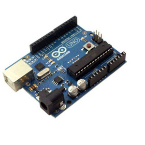

# 30 - Mòdul sensor d'evasió d'obstacles

## Descripció

El mòdul produeix una ona quadrada de 38 kHz. Aquest pols de 38 kHz
s'utilitza per a encendre/apagar el LED IR. Si hi ha un objecte enfront
del LED IR, els polsos infrarojos es reflecteixen i part de l'IR
reflectit és detectat pel receptor IR (HS0038BD). Això li indicaria al
mòdul que hi ha un obstacle i col·locarà el pin de senyal S en LOW. Si
no hi ha obstacle, el pin S estarà enlaire. El mòdul té un rang de
detecció de ~2 40 cm.

El pin EN i el pont EN es proporcionen per a controlar la detecció del
mòdul. Pose un pont en EN per a tindre el mòdul sempre habilitat. Si
desitja tindre control sobre l'habilitació/deshabilitació del mòdul,
retire el pont i connecte el pin EN a HIGH per a habilitar o LOW per a
deshabilitar.


El concepte bàsic de la detecció d'obstacles per infrarojos és
transmetre el senyal IR (emissió) en una direcció i rebre un senyal en
el receptor IR quan els raigs reboten en la superfície de l'objecte.


Hi ha dos potenciòmetres en el mòdul, un que controla la freqüència
d'operació (centrada en 38 kHz) i l'altre que controla la intensitat.
El detector va ser dissenyat per a 38 kHz i el circuit oscil·lador
integrat es basa en un temporitzador 555.

## Especificacions

- Voltatge de funcionament: CC 3,3 V-5 V
- Corrent de treball: ≥20mA
- Temperatura de funcionament: -10 ℃ - +50 ℃
- Distància de detecció: 2-40 cm
- Interfície I/O: 4 fils (- / + / S /EN)
- Senyal d'eixida: nivell TTL (LOW si hi ha un obstacle, HIGH sense obstacle)
- Ajust: ajust la resistència de múltiples tornades
- Angle efectiu: 35 °
- Grandària: 28 mm × 23 mm
- Pes: 9g

## Material

|                               Imatge                               | Descripció                         |
| :----------------------------------------------------------------: | :--------------------------------- |
|   | Arduino Uno o equivalent.          |
|  | Cables de connexió                 |
|  | Mòdul d'evitació d'obstacles KY032 |

## Connexió


## Programació

Codi: ARD030

```Arduino
/*
* Projecte nº: ARD030
* Data: 27/0º/2022
* Descripcio: Prova del sensor d'evitar obstacles
* Nota:
*/

int Led = 13;
int buttonpin = 3;
int val;

void setup()
{
    pinMode(Led, OUTPUT);
    pinMode(buttonpin, INPUT);
}

void loop()
{
    val = digitalRead(buttonpin);
    if (val == HIGH)
    {
        digitalWrite(Led, HIGH);
    }
    else
    {
        digitalWrite(Led, LOW);
    }
}
```

## Veure també

- [Index](../Index.md)
- [README](../README.md)
